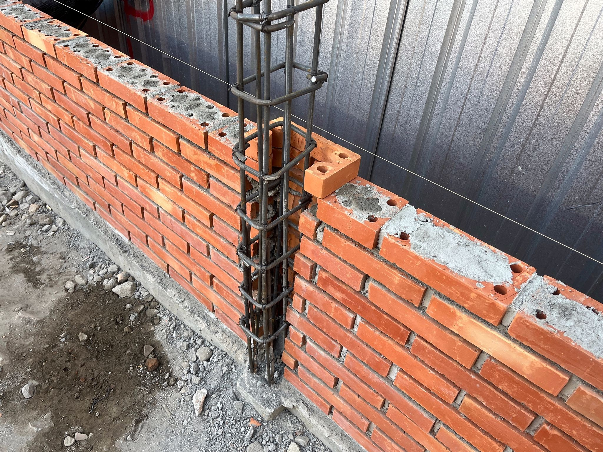

### Building Your Dream Property from the Ground Up: A Professional New Construction Guide

Constructing a new building—whether it is a home, shop house, office, or commercial property—involves much more than simply laying bricks and pouring concrete. It is a long-term investment that requires careful planning, precise execution, and experienced professionals who understand every stage of the construction process.

If you are planning a **new construction project from scratch**, partnering with a trusted contractor and skilled craftsmen is the best way to ensure your building is safe, durable, aesthetically pleasing, and completed within your planned budget.

---

#### Our New Construction Process: From Foundation to Handover

Building on vacant land presents unique challenges. To ensure structural integrity and smooth project execution, our experienced team follows a systematic construction process from start to finish.

##### 1. Site Preparation & Foundation (_The Groundwork_)

The foundation is the most critical part of any structure. A strong foundation provides long-term stability and helps prevent structural issues such as settlement, cracks, and uneven floors.

- **Site Clearing & Leveling:** Preparing the construction area by removing debris, vegetation, and obstacles to create a clean building site.
- **Building Layout Setup (_Bouwplank_):** Installing reference markers to accurately determine the building’s dimensions and position according to the approved blueprint.
- **Excavation & Substructure Work:** Constructing foundations such as stone foundations or reinforced concrete footings, designed according to soil conditions and the building's structural requirements.

##### 2. Structural Framework (_The Skeleton_)

Once the foundation is completed and fully prepared, the main structural elements are constructed to safely support the entire building.

- Installation and casting of **Sloof Beams** (reinforced concrete beams that distribute loads evenly above the foundation).
- Construction of **Columns** and **Ring Beams** to create a strong structural framework.
- Wall installation using clay bricks or lightweight AAC blocks, followed by plastering and surface preparation.

##### 3. Roofing & Exterior Protection (_The Shell_)

At this stage, the building begins to take shape and receives protection from weather conditions such as rain and direct sunlight.

- Installation of roof structures using quality timber or corrosion-resistant light-gauge steel.
- Installation of roofing materials including tiles, metal sheets, or other roofing systems based on your design preferences.

##### 4. Finishing & MEP Works (_Mechanical, Electrical & Plumbing_)

This phase focuses on functionality, aesthetics, and comfort, transforming the structure into a fully usable living or working space.

- **Plumbing & Electrical Installation:** Professional installation of clean water lines, drainage systems, and concealed electrical wiring.
- **Architectural Finishing:** Installation of ceramic or granite flooring, doors and windows, gypsum or PVC ceilings, and final interior and exterior painting.

---

#### Why Choose Our New Construction Services?

| Advantage                         | Benefits for You                                                                                                                      |
| :-------------------------------- | :------------------------------------------------------------------------------------------------------------------------------------ |
| **Transparent Budget Planning**   | Receive a detailed and transparent cost estimate, helping you avoid unexpected expenses during construction.                          |
| **Experienced Construction Team** | Our builders, supervisors, and craftsmen have extensive hands-on experience, ensuring precise workmanship and structural reliability. |
| **Quality Building Materials**    | We recommend and use high-quality construction materials that meet industry standards for long-lasting performance.                   |
| **Workmanship Warranty**          | We provide post-handover support and warranty coverage for minor construction-related issues, giving you additional peace of mind.    |

---

#### New Construction Project Gallery

##### 1. Foundation Excavation & Reinforcement Installation

##### 2. Wall Construction & Structural Column Installation

##### 3. Completed Project / Ready-to-Occupy Building

---

#### Start Building Your Dream Property Today

Your property is a valuable long-term investment. Don't leave its construction to chance. Discuss your new construction plans with our team and receive a **free consultation** tailored to your budget, timeline, and design requirements.

We are ready to help you create a durable, functional, and beautiful building that you can be proud of for years to come.

- **Contact Us via WhatsApp:** [Yakyuk Bangun](https://s.id/Yakyuk-Bangun)
- **Office / Workshop Address:** Jl. Besi Jangkang, Sabelah Barat, Gg. Giri Mulyo, Besi, Sukoharjo, Ngaglik District, Sleman Regency, Special Region of Yogyakarta 55581, Indonesia

---
