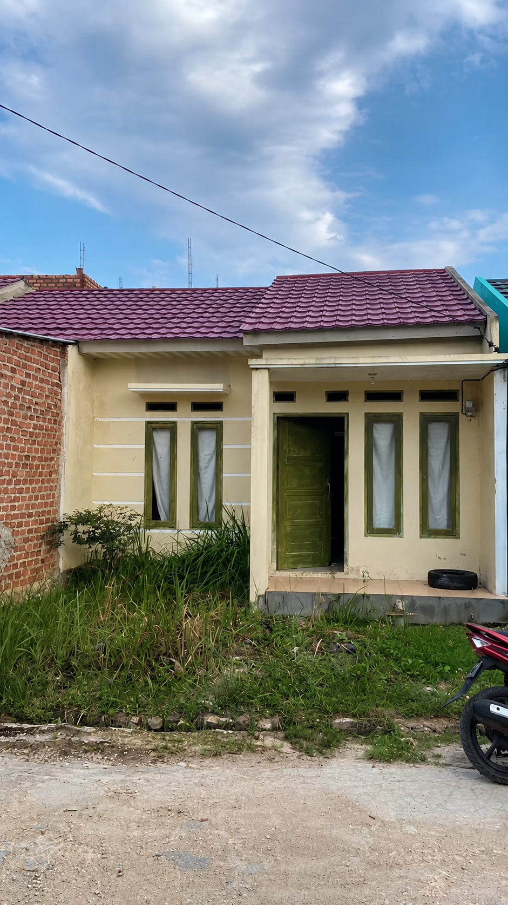
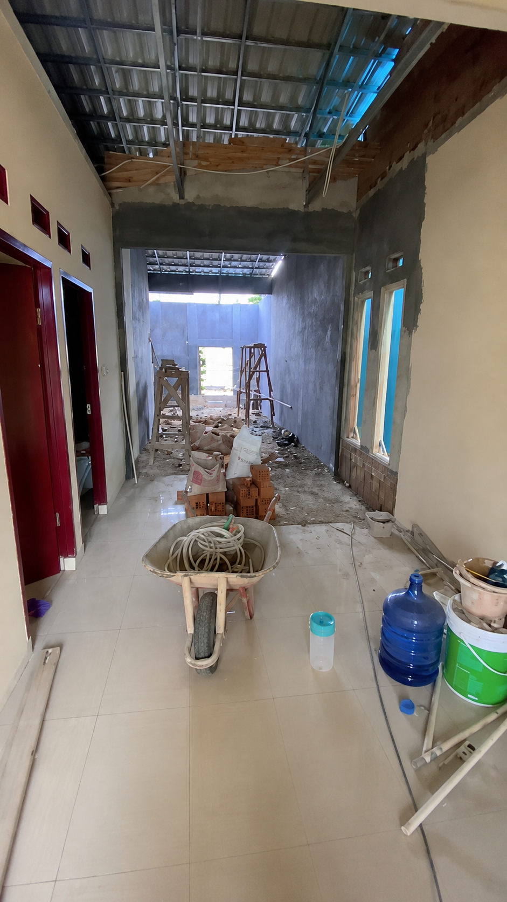
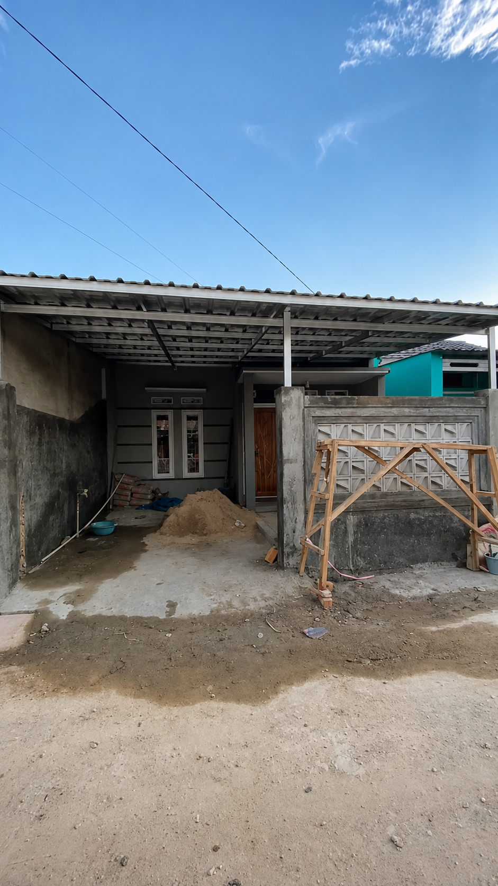
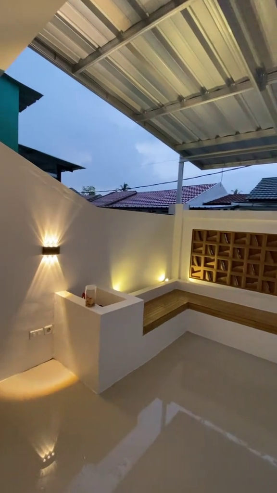
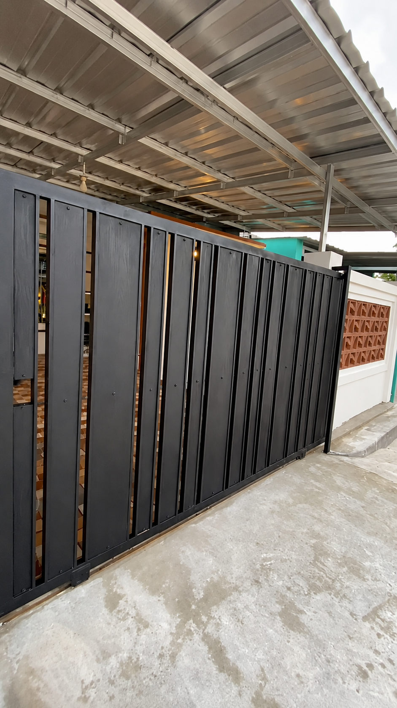

### Transform Your Existing Property into a Modern Living Space: A Complete Renovation Guide

Is your home showing signs of age, suffering from structural issues, or simply no longer meeting your lifestyle needs? Renovation is a smart and cost-effective way to breathe new life into your property without the expense and inconvenience of relocating or purchasing new land.

Whether you are planning a minor upgrade or a complete property makeover, a successful renovation requires careful planning, technical expertise, and experienced craftsmanship. By choosing a **professional renovation contractor**, you can ensure your property is transformed safely, efficiently, and within budget.

---

#### Our Renovation Process: From Demolition to Transformation

Unlike new construction on vacant land, renovation projects require additional precision because existing structures must be integrated with new designs and modern functionality. Our team follows a structured process to ensure the best possible outcome.

##### 1. Property Assessment & Structural Planning (_The Assessment_)

Before any renovation work begins, our specialists conduct a comprehensive inspection of the existing building.

- **Structural Evaluation:** Assessing the condition of foundations, columns, beams, and load-bearing elements to determine whether they can support planned modifications, including additional floors.
- **Damage Identification:** Detecting roof leaks, moisture penetration, plumbing issues, electrical hazards, termite damage, and other structural concerns.
- **Design Consultation:** Aligning your vision and renovation goals with the property's actual condition to create a practical and achievable renovation plan.

##### 2. Demolition & Site Preparation (_The Demolition_)

Once the renovation plan is finalized, the transformation begins with the careful removal of outdated or damaged components.

- **Controlled Demolition:** Removing walls, old roofing systems, flooring, and other elements while preserving structural components that remain part of the new design.
- **Debris Removal & Site Cleanup:** Clearing construction waste to create a safe and organized workspace for the rebuilding phase.

##### 3. Reconstruction & Structural Enhancement (_The Rebuilding_)

At this stage, the property begins to take on its new form through upgrades and structural improvements.

- **Structural Reinforcement:** Strengthening foundations, columns, or other structural components when expanding rooms or adding additional floors.
- **New Wall Construction:** Building new partitions and room layouts using clay bricks or lightweight AAC blocks according to the updated floor plan.
- **Roof Repair or Replacement:** Replacing deteriorated roof structures with durable light-gauge steel systems and modern roofing materials designed for long-term performance.

##### 4. Finishing & Complete Makeover (_The Transformation_)

This is the stage where the property's appearance is completely renewed and modernized.

- **Architectural & Interior Finishes:** Installation of new ceramic or granite flooring, modern aluminum doors and window frames, and minimalist ceiling systems.
- **Painting & Waterproofing:** Application of premium interior and exterior paints, along with waterproofing systems for bathrooms, balconies, rooftops, and other moisture-prone areas.
- **Mechanical, Electrical & Plumbing (MEP) Upgrades:** Replacing outdated electrical wiring for improved safety and reorganizing water supply and drainage systems for better efficiency.

---

#### Why Renovate with Us?

| Service Advantage                    | Real Benefits for Your Property                                                                                |
| :----------------------------------- | :------------------------------------------------------------------------------------------------------------- |
| **Efficient Design Solutions**       | Optimize your existing layout to improve natural lighting, airflow, functionality, and overall comfort.        |
| **Compatible Quality Materials**     | We carefully select materials that integrate seamlessly with your existing structure for long-lasting results. |
| **Transparent & Flexible Budgeting** | Detailed cost estimates for every stage of the renovation help you stay in control of your budget.             |
| **Post-Renovation Warranty**         | Ongoing support and workmanship guarantees provide peace of mind after project completion.                     |

---

#### Transformation Gallery (Before & After)

##### 1. Original Property Condition

##### 2. Demolition & Reconstruction Process

##### 3. Final Result – A Fresh, Modern Living Space

---

#### Give Your Property a Fresh New Look Today

Don't allow minor issues to develop into costly structural problems. Whether you're planning a complete home makeover, expanding your living space, or modernizing an aging property, our renovation specialists are ready to help.

Contact us today for a **free renovation consultation** and receive a detailed cost estimate tailored to your goals, preferences, and budget.

- **Contact Us via WhatsApp:** [Yakyuk Bangun](https://s.id/Yakyuk-Bangun)
- **Office / Workshop Address:** Jl. Besi Jangkang, Sabelah Barat, Gg. Giri Mulyo, Besi, Sukoharjo, Ngaglik District, Sleman Regency, Special Region of Yogyakarta 55581, Indonesia

---
