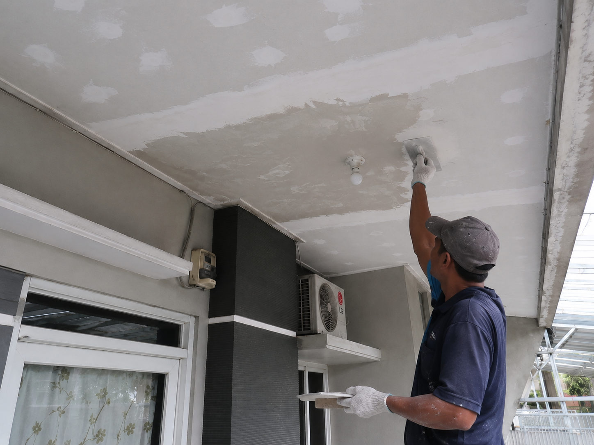
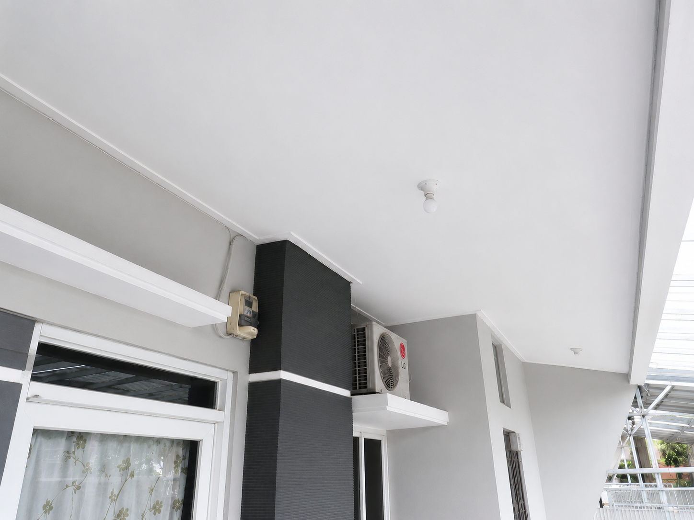

One of Yakyuk Bangun's most requested repair services is ceiling restoration and repair. We also provide professional repair services for bathrooms, doors, gates, roofing systems, walls, and various other building components.

### Damaged or Leaking Ceiling? Restore It to a Smooth, Like-New Finish

Has your ceiling developed water stains, mold growth, sagging panels, or even collapsed due to roof leaks? A damaged ceiling not only affects the appearance of your home but can also create health concerns from mold exposure and pose safety risks if weakened materials begin to fail.

Many homeowners attempt temporary repairs, only to find the problem returning because the root cause of the leak was never properly addressed. With our **professional ceiling repair service**, we don't simply cover the damage—we identify and eliminate the source of the problem, restoring your ceiling to a safe, smooth, and beautiful condition.

---

#### Our Ceiling Repair Process: From Damaged to Like New

We follow a systematic repair process designed to solve the problem completely rather than providing temporary cosmetic fixes.

##### 1. Leak Detection & Root Cause Analysis (_The Leak Investigation_)

Repairing a ceiling without stopping the water intrusion is ineffective. The first step is identifying exactly where the moisture is coming from.

- **Roof & Concrete Deck Inspection:** Checking roof tiles, flashing, gutters, concrete slabs, and other vulnerable areas where water may penetrate the building.
- **Waterproofing Solutions:** Repairing damaged roofing components and applying professional waterproofing systems to prevent future leakage.

##### 2. Removal of Damaged Materials (_The Clean-Up_)

Any compromised ceiling materials must be safely removed before reconstruction begins.

- **Damaged Panel Removal:** Carefully removing sagging, water-damaged, moldy, or deteriorated gypsum, GRC, or plywood ceiling panels.
- **Frame Inspection:** Examining the supporting ceiling framework. Rusted steel members or weakened timber components are reinforced or replaced when necessary.

##### 3. New Ceiling Installation (_The Replacement_)

Once the area is dry, clean, and structurally sound, reconstruction can begin.

- **Precision Panel Installation:** Installing high-quality gypsum or GRC boards that match the surrounding ceiling profile and dimensions.
- **Joint Treatment & Compounding:** Reinforcing seams with mesh tape and applying multiple layers of joint compound to create a seamless surface free from visible lines or imperfections.

##### 4. Sanding & Repainting (_The Flawless Finishing_)

The final stage removes all traces of previous damage and restores a clean, elegant appearance.

- **Fine Surface Sanding:** Carefully sanding all repaired areas until perfectly smooth and level under both natural and artificial lighting.
- **Primer & Finish Coating:** Applying moisture-resistant primer followed by premium ceiling paint in bright white or the color of your choice. The result is a flawless, freshly finished ceiling that looks brand new.

---

#### Why Choose Our Repair Services?

| Our Advantages                  | What You Gain                                                                                                                      |
| :------------------------------ | :--------------------------------------------------------------------------------------------------------------------------------- |
| **Root Cause Resolution**       | We don't simply patch visible damage—we eliminate the underlying source of leaks and moisture problems.                            |
| **Flawless Finishing Quality**  | Our craftsmen are highly skilled in compounding, surface preparation, and finishing techniques, ensuring perfectly smooth results. |
| **Clean & Protected Work Area** | Floors and furniture are covered with protective materials to minimize dust and paint contamination during repairs.                |
| **Premium Building Materials**  | We use high-quality, moisture-resistant ceiling boards and durable repair materials for long-lasting performance.                  |

---

#### Ceiling Repair Gallery (Before & After)

##### 1. Initial Condition – Damaged & Worn Ceiling

##### 2. Repair & Joint Compounding Process

##### 3. Final Result – Smooth Finish with Fresh Paint

---

#### Restore the Comfort and Safety of Your Home Today

Don't wait until minor ceiling damage becomes a major structural issue. Water stains, mold growth, and weakened ceiling panels can worsen over time and lead to more expensive repairs.

Contact our professional repair team today for a **free consultation and repair estimate**. Whether you need ceiling restoration, bathroom repairs, door replacement, gate repairs, leak repairs, or general property maintenance, we're ready to help.

- **Contact Us via WhatsApp:** [Yakyuk Bangun](https://s.id/Yakyuk-Bangun)
- **Office / Workshop Address:** Jl. Besi Jangkang, Sabelah Barat, Gg. Giri Mulyo, Besi, Sukoharjo, Ngaglik District, Sleman Regency, Special Region of Yogyakarta 55581, Indonesia

---
