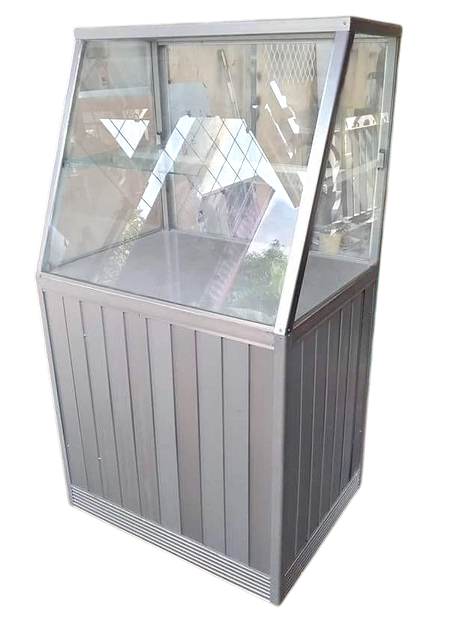
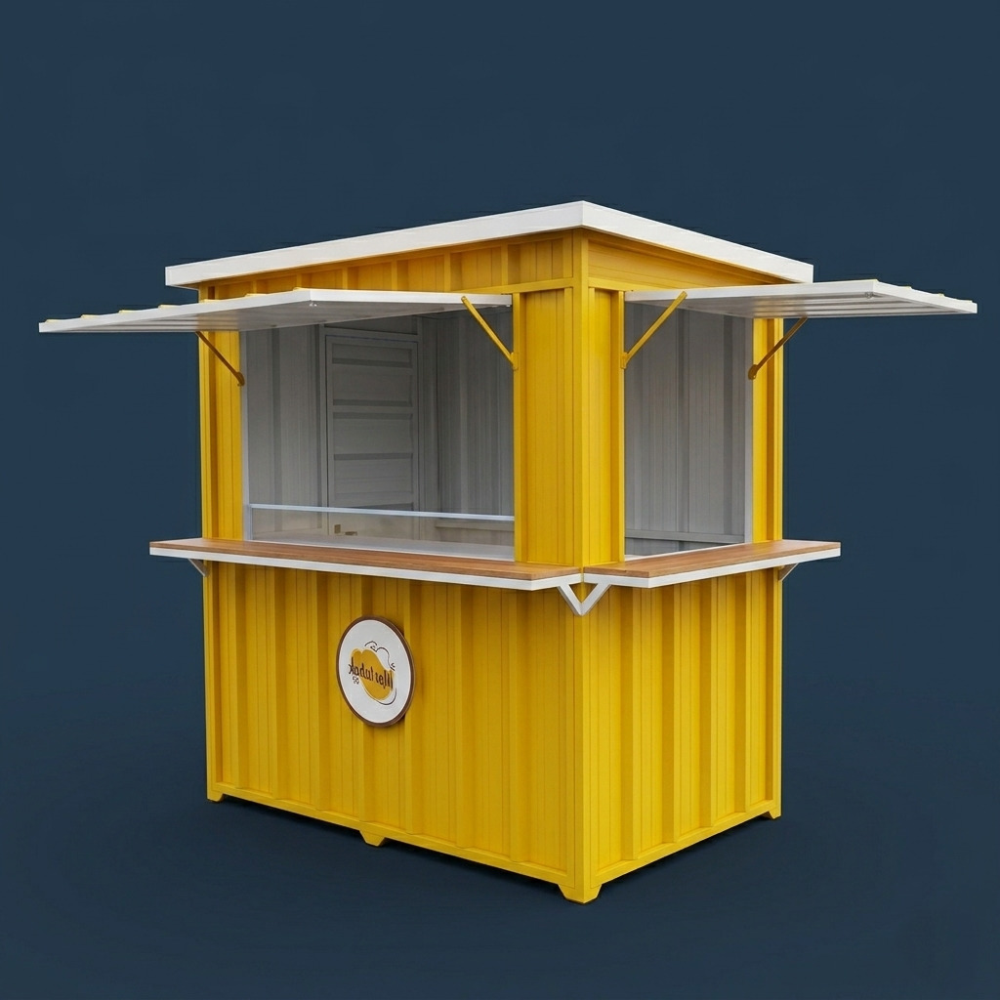

### Professional Steel Fabrication & Aluminum Solutions: Gates, Canopies, Showcases, Container Booths, and More

Steel and aluminum have become essential elements in modern construction and property development. Beyond providing strength and security, professionally fabricated metal and aluminum structures can significantly enhance the appearance, functionality, and value of residential and commercial properties.

Whether you need a durable steel structure, a custom aluminum installation, or a complete business booth solution, choosing a **professional steel and aluminum contractor** ensures long-lasting quality, precise workmanship, and dependable results.

---

#### Our Steel & Aluminum Services

We provide a wide range of custom fabrication and installation services for residential, commercial, and retail applications using steel, stainless steel, aluminum, and glass.

##### 1. Custom Steel Gates & Entrance Systems

A gate is more than just security—it is often the first impression of your property.

- **Modern Design Options:** From minimalist contemporary styles and industrial-inspired designs to sliding and folding gate systems.
- **Durable Materials:** Fabricated using galvanized hollow steel with anti-corrosion coatings and high-quality finishing systems for superior weather resistance.

##### 2. Residential Canopies & Carport Covers

Protect your vehicles, outdoor spaces, and building entrances from harsh sunlight and heavy rainfall.

- **Strong Structural Framework:** Built using heavy-duty hollow steel or lightweight structural steel engineered for safety and durability.
- **Multiple Roofing Choices:** Available with Spandek roofing, polycarbonate panels, transparent Solarflat roofing, or elegant tempered glass roofing systems.

##### 3. Custom Aluminum & Glass Display Showcases

Professional display solutions designed to enhance product presentation while maintaining cleanliness and durability.

- **Tailor-Made Designs:** Suitable for retail stores, mobile phone counters, clothing displays, food displays, and aluminum kitchen cabinets.
- **Practical Benefits:** Termite-resistant, lightweight, low maintenance, easy to clean, and fitted with safe, high-quality glass panels.

##### 4. Modern Container-Style Business Booths

Container and semi-container booths have become increasingly popular for food businesses, cafés, beverage stalls, and retail ventures thanks to their modern appearance and portability.

- **Premium Construction:** Manufactured using steel angle and hollow steel frames combined with high-quality wall panels, integrated electrical wiring, and foldable serving counters.
- **Custom Branding Finishes:** Professionally spray-painted in colors and designs that reflect your business identity and brand image.

##### 5. Additional Fabrication Services

We also provide:

- Window security grilles and mosquito screen doors.
- Spiral staircases, straight staircases, and balcony railings.
- Aluminum clothes drying racks and foldable wall-mounted drying systems.
- Custom steel structures and decorative metalwork for residential and commercial properties.

---

#### Why Choose Our Steel & Aluminum Services?

| Service Advantages               | Benefits for You                                                                                                                         |
| :------------------------------- | :--------------------------------------------------------------------------------------------------------------------------------------- |
| **Professional Welding Quality** | Full-strength welds with clean finishing produce durable joints, smooth surfaces, and long-lasting structural integrity.                 |
| **Precision Fabrication**        | Every aluminum frame, glass panel, and steel component is measured and installed with millimeter-level accuracy for optimal performance. |
| **Material Transparency**        | We guarantee that all steel thicknesses, aluminum profiles, and specifications supplied match the agreed project requirements.           |
| **On-Time Project Completion**   | Fabrication work is carefully scheduled in our workshop, reducing installation time and minimizing disruption at your property.          |

---

#### Project Gallery

##### 1. Modern Steel Gate & Residential Canopy

##### 2. Custom Aluminum & Glass Display Showcase

##### 3. Modern Container Food & Retail Booth

---

#### Let's Build Something Great Together

Whether you need a secure entrance gate, an elegant canopy, a professional display showcase, or a custom business booth, our team is ready to help bring your ideas to life.

Take advantage of our **free consultation and site survey** service within our service area. We'll help you choose the right design, materials, and specifications to match your budget and project requirements.

- **Contact Us via WhatsApp:** [Yakyuk Bangun](https://s.id/Yakyuk-Bangun)
- **Office / Workshop Address:** Jl. Besi Jangkang, Sabelah Barat, Gg. Giri Mulyo, Besi, Sukoharjo, Ngaglik District, Sleman Regency, Special Region of Yogyakarta 55581, Indonesia

---
