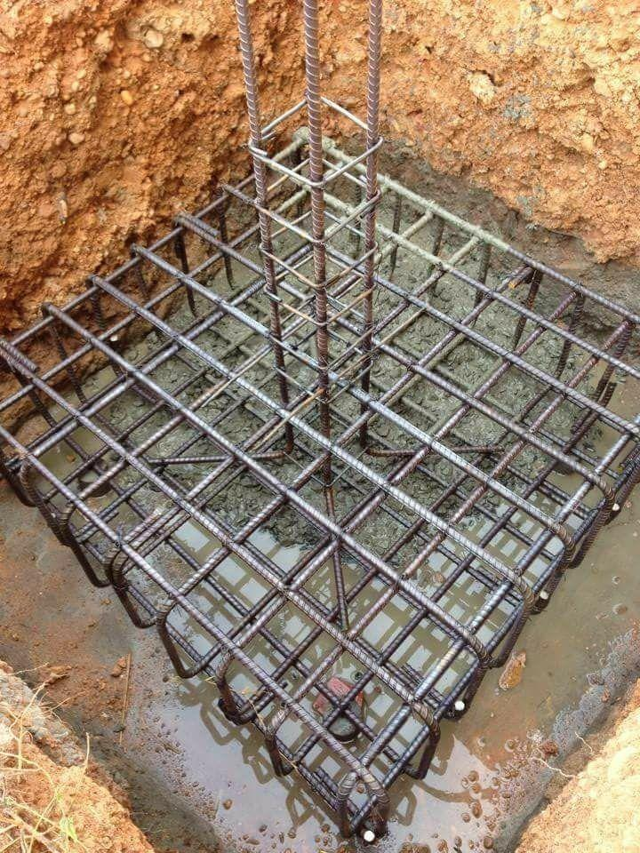
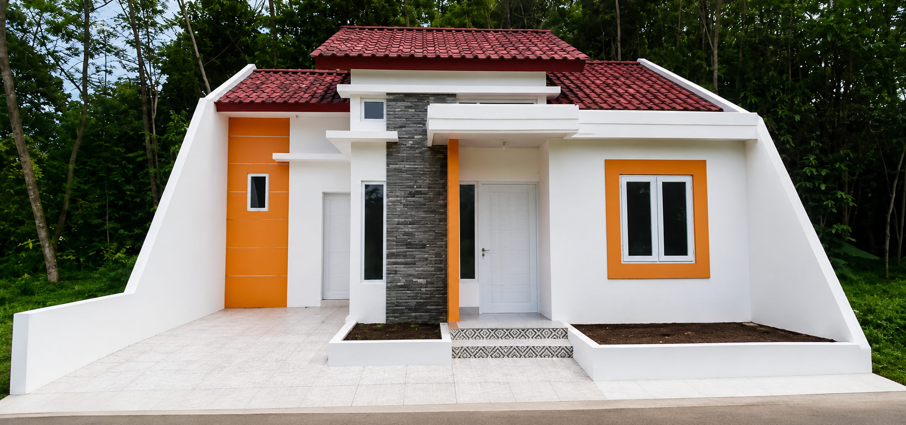

### Membangun Rumah Impian dari Nol: Panduan Jasa Bangun Baru Profesional

Mendirikan sebuah bangunan—baik itu rumah tinggal, ruko, maupun kantor—bukan sekadar menyusun bata dan semen. Ini adalah investasi jangka panjang yang membutuhkan perencanaan matang, eksekusi presisi, dan tenaga ahli yang berpengalaman di bidangnya.

Bagi Anda yang berencana melakukan **bangun baru dari nol**, mempercayakannya kepada jasa tukang dan kontraktor profesional adalah langkah terbaik untuk memastikan bangunan berdiri kokoh, aman, dan sesuai dengan anggaran yang direncanakan.

---

#### Tahapan Jasa Bangun Baru: Dari Pondasi hingga Serah Terima Kunci

Membangun di atas lahan kosong memiliki tantangan tersendiri. Berikut adalah tahapan sistematis yang dilakukan oleh tim ahli kami untuk memastikan proyek bangunan Anda berjalan lancar tanpa kendala struktur di masa depan:

##### 1. Tahap Persiapan & Pondasi (_The Groundwork_)

Pondasi adalah bagian paling krusial dari sebuah bangunan. Jika pondasi lemah, risiko keretakan struktur atau penurunan bangunan di masa depan akan sangat tinggi.

- **Pembersihan & Perataan Lahan:** Menyiapkan area kerja agar bersih dari puing atau tanaman liar dan siap dibangun.
- **Bouwplank:** Pemasangan patok kayu pembatas untuk menentukan titik as bangunan sesuai dengan cetak biru (_blueprint_) desain.
- **Galian & Struktur Bawah:** Pembuatan pondasi (pondasi batu kali, _footplate_ / cakar ayam) yang kedalamannya disesuaikan dengan kondisi tanah serta jumlah lantai bangunan.

##### 2. Tahap Struktur Utama (_The Skeleton_)

Setelah pondasi matang dan kokoh, saatnya membangun "tulang punggung" bangunan agar mampu menahan beban keseluruhan secara aman.

- Pengecoran **Sloof** (balok beton bertulang yang diletakkan di atas pondasi untuk meratakan beban).
- Mendirikan **Kolom** (tiang tegak struktur) dan **Balok Elevasi** (_ring balk_).
- Pemasangan dinding (bata merah atau bata ringan/hebel) beserta plesteran dan acian awal.

##### 3. Tahap Atap & Penutup (_The Shell_)

Tahap ini bertujuan untuk melindungi bagian dalam bangunan dari cuaca ekstrem seperti panas matahari dan hujan selama proses konstruksi lanjutan.

- Pemasangan rangka atap (menggunakan kayu berkualitas tinggi atau baja ringan anti karat).
- Pemasangan genteng, spandek, atau jenis penutup atap lainnya sesuai pilihan estetika Anda.

##### 4. Tahap Finishing & MEP (_Mechanical, Electrical, Plumbing_)

Tahap di mana bangunan mulai dikerjakan detail estetikanya dan dipastikan siap untuk dihuni dengan nyaman.

- **Instalasi Air & Listrik:** Penataan jalur pipa air bersih, pipa air kotor, serta penanaman kabel listrik secara rapi di dalam dinding.
- **Pekerjaan Arsitektural:** Pemasangan keramik atau granit lantai, pemasangan kusen pintu dan jendela, pemasangan plafond (gypsum/PVC), serta pengecatan akhir (_finishing_) interior maupun eksterior.

---

#### Mengapa Memilih Jasa Bangun Baru Kami?

| Keunggulan                    | Manfaat untuk Anda                                                                                                               |
| :---------------------------- | :------------------------------------------------------------------------------------------------------------------------------- |
| **Transparansi RAB**          | Anda mendapatkan Rencana Anggaran Biaya yang detail dan transparan, meminimalisir pembengkakan dana tak terduga di tengah jalan. |
| **Tenaga Ahli Berpengalaman** | Tukang, kenek, dan mandor kami adalah spesialis di bidangnya, memastikan hasil pengerjaan rapi, presisi, dan kokoh.              |
| **Material Berkualitas**      | Kami merekomendasikan dan menggunakan bahan bangunan berstandar SNI demi ketahanan jangka panjang bangunan Anda.                 |
| **Garansi Pemeliharaan**      | Kami memberikan jaminan atau garansi setelah serah terima kunci jika terdapat kendala minor pada bangunan pasca konstruksi.      |

---

#### Galeri Proses Pembangunan Baru

##### 1. Proses Penggalian & Perakitan Besi Cakar Ayam

##### 2. Proses Pemasangan Dinding & Struktur Kolom

##### 3. Hasil Akhir / Bangunan Siap Huni

---

#### Wujudkan Bangunan Impian Anda Sekarang!

Jangan pertaruhkan aset dan kenyamanan jangka panjang keluarga Anda pada tenaga yang salah. Konsultasikan rencana bangun baru Anda bersama tim kami secara **Gratis**. Kami siap membantu menyusun estimasi biaya terbaik yang sesuai dengan anggaran (_budget_) dan kebutuhan ruang Anda.

- **Hubungi Kami via WhatsApp:** [Yakyuk Bangun](https://s.id/Yakyuk-Bangun)
- **Alamat Kantor / Workshop:** Jl. Besi Jangkang, Sabelah Barat, Gg. Giri Mulyo, Besi, Sukoharjo, Kec. Ngaglik, Kabupaten Sleman, Daerah Istimewa Yogyakarta 55581
