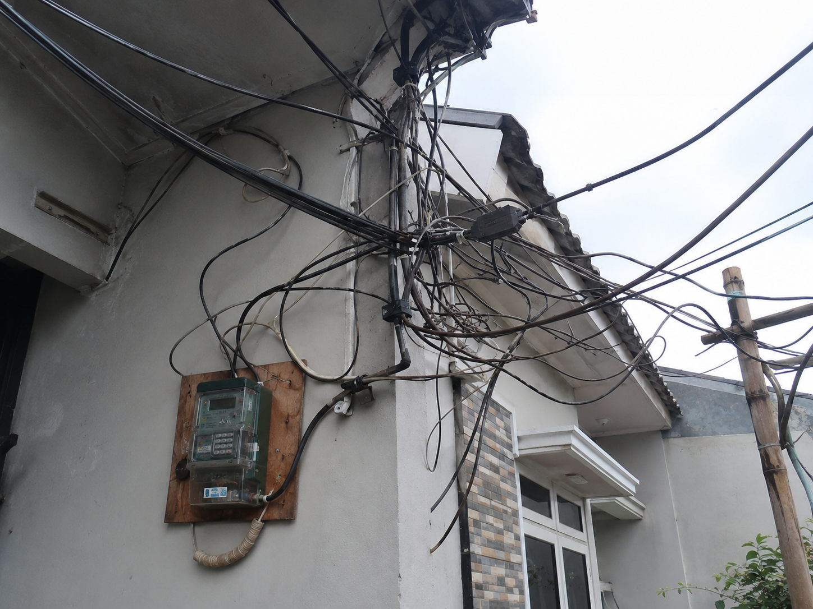
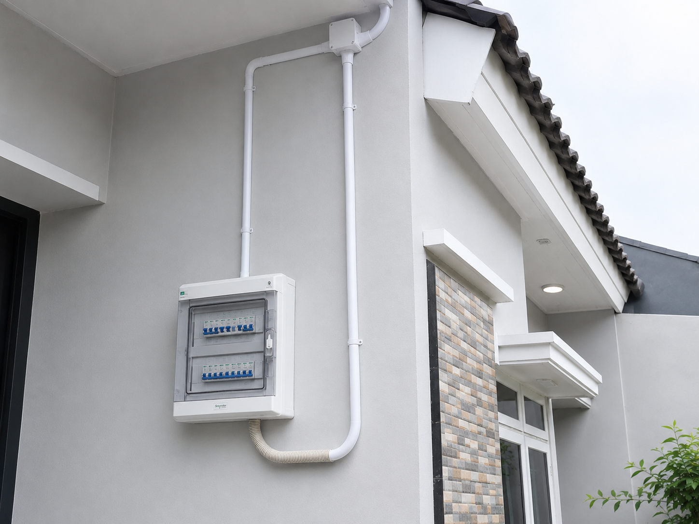

### Jasa Instalasi Listrik Profesional: Solusi Pasang Baru dan Peremajaan Jalur Kabel Aman

Listrik adalah urat nadi setiap bangunan modern, baik untuk mendukung kenyamanan aktivitas keluarga di rumah maupun kelancaran operasional tempat usaha. Namun, sistem kelistrikan yang tidak ditangani dengan benar merupakan salah satu pemicu utama risiko korsleting yang dapat menyebabkan kebakaran fatal.

Apakah Anda sedang membangun properti dan membutuhkan jaringan listrik yang dirancang dari nol? Atau bangunan lama Anda sering mengalami kendala listrik jepret, redup, atau bau hangus? Mempercayakannya pada **jasa instalasi listrik profesional** adalah jaminan keamanan investasi, kenyamanan, dan keselamatan jangka panjang aset berharga Anda.

---

#### Layanan Utama Jasa Kelistrikan Kami

Kami melayani pengerjaan kelistrikan secara menyeluruh, mencakup perencanaan jaringan baru hingga peremajaan sistem lama:

##### 1. Instalasi Listrik Baru (Pemasangan dari Nol)

Bagi Anda yang sedang melakukan bangun baru, kami merancang sistem distribusi daya yang optimal, efisien, dan rapi sejak awal konstruksi.

- **Perencanaan Denah Titik Lampu & Saklar:** Menentukan tata letak titik lampu, saklar, dan stop kontak yang ergonomis serta fungsional sesuai dengan kebutuhan interior ruangan.
- **Pembagian Grup Daya (MCB Box):** Membagi beban listrik ke dalam beberapa grup MCB yang seimbang (misalnya grup AC, grup pompa air, grup dapur, dan lampu). Hal ini mencegah listrik mendadak padam/turun akibat beban berlebih di satu titik.
- **Pemasangan Grounding Sistem:** Menanam jalur pembumian (_grounding_) yang standar dan aman guna melindungi peralatan elektronik Anda dari sambaran petir atau lonjakan tegangan tak stabil.

##### 2. Perubahan & Peremajaan Instalasi Listrik Lama (Rewiring)

Seiring berjalannya waktu, kabel listrik di dalam dinding bangunan lama akan mengalami penurunan kualitas (getas/digigit tikus) yang sangat berbahaya. Kami siap melakukan perbaikan total maupun parsial.

- **Penggantian Kabel Usang:** Mengganti kabel-kabel tua berukuran kecil dengan kabel berstandar SNI (seperti NYA, NYM, atau NYY) yang memiliki kapasitas hantar arus (KHA) sesuai daya listrik saat ini.
- **Penambahan Titik Daya Baru:** Menambah stop kontak baru untuk kebutuhan peralatan elektronik tambahan (seperti AC baru, _water heater_, atau mesin cuci) tanpa merusak jalur utama.
- **Audit & Troubleshooting Kelistrikan:** Melacak penyebab utama korsleting tersembunyi, kebocoran arus listrik yang membuat tagihan membengkak, atau perbaikan MCB utama yang sering turun.

---

#### Mengapa Harus Menggunakan Jasa Kelistrikan Kami?

| Keunggulan                       | Manfaat Nyata untuk Anda                                                                                                                          |
| :------------------------------- | :------------------------------------------------------------------------------------------------------------------------------------------------ |
| **Material Berstandar SNI**      | Kami hanya menggunakan kabel dan material merek premium (seperti Supreme, Eterna, atau Schneider) yang bersertifikat SNI dan LMK.                 |
| **Pekerjaan Rapi (In-Baw)**      | Kabel ditanam di dalam dinding menggunakan pipa conduit PVC pelindung khusus, sehingga rapi, aman dari gesekan, dan terhindar dari gigitan tikus. |
| **Teknisi Ahli & Berpengalaman** | Dikerjakan oleh instalatur listrik yang paham regulasi PUIL (Persyaratan Umum Instalasi Listrik), meminimalisir salah jalur atau beban pincang.   |
| **Transparansi Diagram Jalur**   | Anda mendapatkan skema atau peta jalur kabel kelistrikan setelah pengerjaan selesai, guna mempermudah renovasi atau pengecekan di masa depan.     |

---

#### Galeri Transformasi (Before vs After)

##### 1. Kondisi Jalur Kabel Lama yang Semrawut

##### 2. Kondisi setelah Penataan dan Pemasangan MCB Baru

