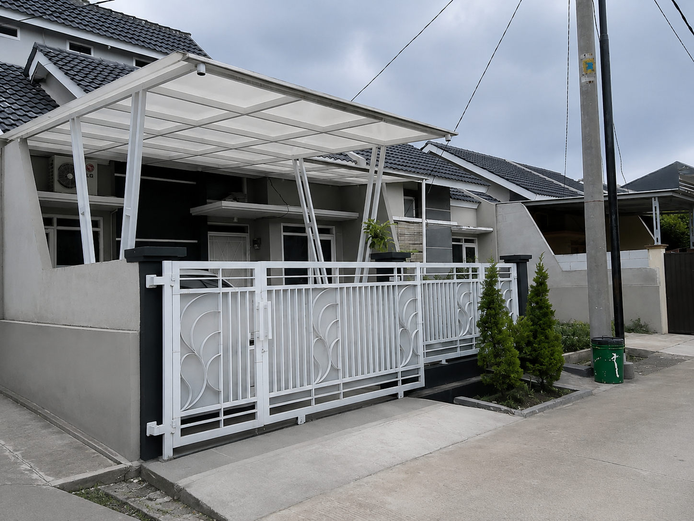

### Solusi Bengkel Las & Aluminium Profesional: Pembuatan Pagar, Kanopi, Etalase, hingga Booth Container

Elemen besi dan aluminium merupakan komponen penting dalam konstruksi bangunan modern saat ini. Selain memberikan perlindungan keamanan yang maksimal, pengaplikasian material logam dan aluminium yang presisi mampu mendongkrak nilai estetika serta fungsionalitas, baik untuk rumah tinggal maupun tempat usaha.

Jika Anda membutuhkan konstruksi besi yang kokoh atau instalasi aluminium yang rapi, mempercayakannya pada **jasa las & aluminium profesional** adalah kunci untuk mendapatkan hasil akhir yang awet, presisi, dan bergaransi.

---

#### Layanan Unggulan Jasa Las & Aluminium Kami

Kami melayani berbagai macam pembuatan dan perakitan interior maupun eksterior berbasis besi, stainless steel, aluminium, dan kaca:

##### 1. Pembuatan Pagar & Pintu Besi Minimalis

Pagar adalah benteng pertama keamanan sekaligus wajah dari properti Anda.

- **Pilihan Desain:** Mulai dari konsep minimalis modern (garis vertikal/horizontal), industrial (menggunakan _expanded metal_ / _perforated plate_), hingga pintu dorong/lipat otomatis.
- **Material Berkualitas:** Menggunakan besi hollow galvanis anti-karat yang dilapisi oleh cat khusus (_zinc chromate_) untuk ketahanan maksimal terhadap cuaca.

##### 2. Pemasangan Kanopi Rumah & Carport

Melindungi kendaraan dan area teras Anda dari terik matahari serta guyuran air hujan.

- **Rangka Kokoh:** Rangka besi hollow tebal atau baja ringan yang dihitung beban strukturnya secara aman.
- **Varian Atap:** Tersedia pilihan penutup atap mulai dari Spandek (polos/perdam), Polycarbonate, Solarflat (transparan jernih), hingga atap Kaca Tempered untuk kesan mewah.

##### 3. Pembuatan Etalase Aluminium + Kaca

Solusi media pajang (display) yang rapi, higienis, dan profesional untuk berbagai jenis usaha dagang Anda.

- **Custom Desain:** Pembuatan etalase toko, konter HP, lemari kaca pakaian, hingga rak kitchen set aluminium untuk rumah tangga.
- **Keunggulan:** Bebas rayap, tidak memuai, ringan, mudah dibersihkan, dan menggunakan kaca dengan ketebalan standar aman (5mm - 8mm).

##### 4. Booth Jualan Model Container (Modern Minimalis)

Bagi Anda yang ingin memulai bisnis kuliner atau retail, _booth container_ atau _semi-container_ adalah pilihan paling populer karena tampilannya yang menarik perhatian pelanggan dan mudah dipindahkan.

- **Konstruksi Spesifikasi Tinggi:** Dibuat dari rangka besi siku/hollow, dinding menggunakan spandek/bondek berkualitas, lengkap dengan instalasi jalur kabel listrik dan meja saji _foldable_ (lipat).
- **Finishing Estetis:** Dicat menggunakan teknik _spray painting_ dengan pilihan warna cerah atau estetik sesuai dengan _branding_ usaha Anda.

##### 5. Layanan Konstruksi Lainnya

- Pembuatan Teralis Jendela & Pintu Kasa Nyamuk (Kawat Nyamuk).
- Pembuatan Tangga Putar, Tangga Rebah, dan Railing Balkon.
- Konstruksi Jemuran Pakaian Aluminium & Jemuran Dinding Lipat.

---

#### Mengapa Memilih Layanan Las & Aluminium Kami?

| Keunggulan Layanan           | Manfaat yang Anda Terima                                                                                                                 |
| :--------------------------- | :--------------------------------------------------------------------------------------------------------------------------------------- |
| **Pengelasan Rapi & Matang** | Teknik las penuh (bukan sekadar titik), menghasilkan sambungan besi yang sangat kuat, minim pori, dan hasil gerinda yang halus.          |
| **Presisi Tinggi**           | Pemasangan kusen dan kaca aluminium diukur dengan akurasi milimeter, memastikan pintu/jendela tidak seret dan kedap.                     |
| **Transparansi Bahan**       | Kami menjamin ketebalan besi, hollow, dan profil aluminium yang dikirim ke lokasi sesuai dengan kesepakatan spesifikasi awal (No Banci). |
| **Selesai Tepat Waktu**      | Proses pabrikasi di workshop dikerjakan secara terjadwal sehingga waktu instalasi di lokasi konsumen menjadi lebih cepat.                |

---

#### Galeri Contoh Produk

##### 1. Pagar Besi & Kanopi Minimalis

##### 2. Etalase Aluminium Kaca Custom

##### 3. Booth Container Kuliner Kekinian

---

#### Konsultasikan Kebutuhan Konstruksi Anda Sekarang!

Wujudkan elemen pengaman dan dekorasi terbaik untuk bangunan maupun tempat usaha Anda bersama kami. Nikmati layanan survei lokasi dan konsultasi desain secara **Gratis** untuk wilayah jangkauan kami.

- **Hubungi Kami via WhatsApp:** [Yakyuk Bangun](https://s.id/Yakyuk-Bangun)
- **Alamat Kantor / Workshop:** Jl. Besi Jangkang, Sabelah Barat, Gg. Giri Mulyo, Besi, Sukoharjo, Kec. Ngaglik, Kabupaten Sleman, Daerah Istimewa Yogyakarta 55581
