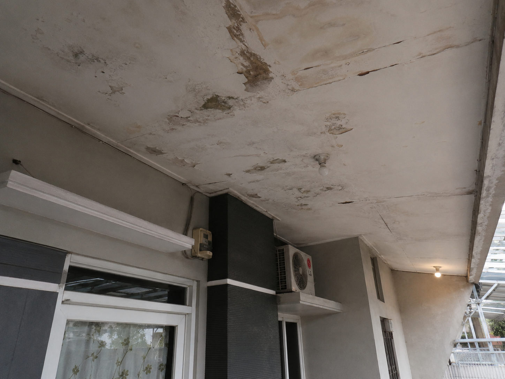

Salah satu jasa perbaikan dari Yakyuk Bangun adalah perbaikan plafon. Kami juga melayani perbaikan kamar mandi, pintu, pagar, dan lain-lainya.

### Solusi Plafon Rusak & Bocor: Jasa Perbaikan Plafon Profesional Menjadi Mulus Kembali

Plafon rumah Anda mengalami bercak kuning, berjamur, atau bahkan melar dan jebol akibat rembesan air bocor? Plafon yang rusak tidak hanya merusak estetika interior rumah, tetapi juga menyimpan risiko kesehatan akibat spora jamur serta bahaya runtuh yang dapat mengancam keselamatan keluarga Anda.

Melakukan perbaikan plafon secara mandiri seringkali tidak menuntaskan masalah jika sumber kebocoran utamanya tidak diatasi terlebih dahulu. Mempercayakannya pada **jasa perbaikan profesional** adalah langkah cerdas untuk mengembalikan fungsi atap pelindung Anda menjadi kokoh, mulus, dan indah dipandang seperti baru.

---

####Tahapan Jasa Perbaikan Plafon: Dari Kondisi Rusak hingga Mulus Kembali

Kami menerapkan metode penanganan yang sistematis dan menyeluruh. Kami tidak hanya menambal bagian yang rusak, melainkan menyelesaikan masalah dari akar penyebabnya:

##### 1. Deteksi Sumber Kebocoran (_The Leak Investigation_)

Memperbaiki plafon tanpa menghentikan air adalah hal yang sia-sia. Tahap awal yang kami lakukan adalah melacak dari mana air berasal.

- **Inspeksi Atap & Dak:** Memeriksa area genteng yang bergeser, retakan pada dak beton, atau talang air yang tersumbat yang memicu rembesan ke plafon.
- **Solusi Waterproofing:** Melakukan perbaikan atap atau pelapisan semen anti-bocor (_waterproofing_) terlebih dahulu agar air tidak lagi merembes ke bawah.

##### 2. Pembongkaran Area Lapuk & Berjamur (_The Clean Up_)

Plafon lama yang sudah rusak, lapuk, dan rentan runtuh harus dibersihkan demi keamanan proses kerja.

- **Pemotongan Bagian Rusak:** Memotret dan menurunkan lembaran plafon (Gypsum/GRC/Triplek) yang telah melorot atau lapuk terkena air.
- **Pembersihan Rangka:** Memeriksa kondisi rangka plafon (hollow baja ringan atau kayu). Jika ada rangka yang berkarat atau keropos, kami akan melakukan perkuatan atau penggantian rangka baru.

##### 3. Pemasangan Plafon Baru (_The Replacement_)

Setelah area bersih dan dipastikan kering, kami memulai proses rekonstruksi panel penutup.

- **Pemasangan Panel Presisi:** Memasang lembaran papan gypsum atau GRC baru yang berkualitas tinggi, disesuaikan dengan ketebalan plafon sekitarnya.
- **Penyambungan (_Componing_):** Menutup celah antar-sambungan menggunakan _mesh tape_ dan compound khusus plafon secara berlapis agar rata dan tidak terlihat bergaris.

##### 4. Pengamplasan & Pengecatan Ulang (_The Flawless Finishing_)

Tahap akhir untuk melenyapkan semua jejak kerusakan masa lalu dan memunculkan kembali kemewahan ruangan Anda.

- **Pengamplasan Halus:** Mengamplas seluruh permukaan compound secara detail hingga benar-benar rata, halus, dan tidak bergelombang saat terkena cahaya lampu.
- **Pengecatan Base Coat & Cat Utama:** Melapisi plafon dengan cat dasar (_alkali sealer_) untuk menahan kelembapan, dilanjutkan dengan pengecatan utama menggunakan cat khusus plafon berwarna putih bersih atau warna pilihan Anda. Hasil akhirnya? Plafon kembali mulus total tanpa noda!

---

#### Mengapa Memilih Jasa Perbaikan Kami?

| Keunggulan Kami                | Hasil yang Anda Dapatkan                                                                                                    |
| :----------------------------- | :-------------------------------------------------------------------------------------------------------------------------- |
| **Atasi Akar Masalah**         | Kami tidak sekadar menambal, tetapi memastikan kebocoran atap di atasnya dihentikan total.                                  |
| **Pengerjaan Tanpa Gelombang** | Tukang kami memiliki keahlian tinggi dalam teknik _finishing compound_ dan pengamplasan, menjamin hasil akhir mulus rata.   |
| **Area Kerja Tetap Bersih**    | Kami menggunakan penutup plastik proteksi untuk melindungi lantai dan furnitur Anda dari debu sisa amplas atau tetesan cat. |
| **Pilihan Material Premium**   | Menggunakan papan gypsum tahan lembap (_moisture resistant_) untuk area-area yang rawan agar plafon lebih awet.             |

---

#### Galeri Perbaikan Plafon (Before vs After)

##### 1. Kondisi Awal (Plafon Rusak & Lusuh)

##### 2. Proses Perbaikan & Componing

##### 3. Hasil Akhir (Mulus dengan Cat Baru)

---

#### Kembalikan Kenyamanan Rumah Anda Sekarang!

Jangan tunggu sampai plafon rumah Anda jebol dan menimpa barang berharga atau keluarga Anda. Segera atasi noda bocor dan kerusakan plafon Anda bersama tim profesional kami. Konsultasi dan estimasi biaya perbaikan **Gratis**!

- **Hubungi Kami via WhatsApp:** [Yakyuk Bangun](https://s.id/Yakyuk-Bangun)
- **Alamat Kantor / Workshop:** Jl. Besi Jangkang, Sabelah Barat, Gg. Giri Mulyo, Besi, Sukoharjo, Kec. Ngaglik, Kabupaten Sleman, Daerah Istimewa Yogyakarta 55581
