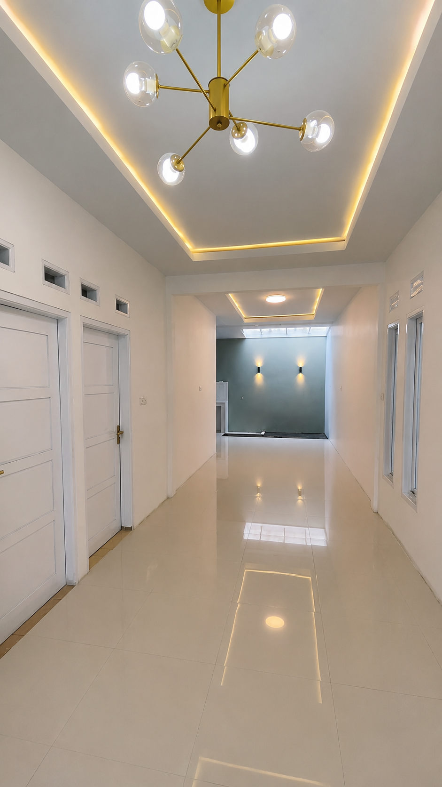

### Transformasi Hunian Lama Jadi Baru: Panduan Lengkap Jasa Renovasi Rumah Profesional

Memiliki rumah lama yang mulai mengalami kerusakan, atau sekadar bosan dengan tata letak (_layout_) yang itu-itu saja? Melakukan renovasi adalah solusi cerdas untuk menyulap bangunan lama Anda menjadi hunian yang modern, fungsional, dan estetis tanpa harus pindah lokasi atau membeli tanah baru.

Proses renovasi bangunan—baik skala kecil maupun perombakan total (_overhaul_)—memerlukan perencanaan struktural yang matang. Mempercayakannya pada **jasa renovasi profesional** memastikan setiap sudut bangunan lama Anda bertransformasi dengan aman, rapi, dan sesuai dengan anggaran yang direncanakan.

---

#### Tahapan Jasa Renovasi: Dari Bongkar Bangunan Lama hingga Tampilan Baru

Berbeda dengan membangun dari nol di atas lahan kosong, renovasi membutuhkan ketelitian ekstra karena harus mengawinkan struktur bangunan lama dengan konsep desain yang baru. Berikut adalah tahapan sistematis yang kami lakukan:

##### 1. Tahap Inspeksi & Perencanaan Struktural (_The Assessment_)

Sebelum alat konstruksi menyentuh bangunan, tim ahli kami akan melakukan audit menyeluruh terhadap kondisi fisik bangunan lama.

- **Cek Kekuatan Struktur:** Memeriksa apakah tiang struktur (kolom) dan pondasi lama masih layak untuk menopang beban baru (terutama jika ingin ditingkat menjadi 2 lantai).
- **Identifikasi Kerusakan:** Mendata titik-titik kebocoran, rembesan air dinding, instalasi pipa yang mampet, atau kerusakan akibat rayap.
- **Finalisasi Desain Baru:** Menyelaraskan keinginan Anda terkait tampilan baru dengan kondisi riil di lapangan.

##### 2. Tahap Pembongkaran & Pembersihan (_The Demolition_)

Setelah rencana matang, proses transformasi fisik dimulai dengan membongkar area-area yang akan diubah.

- **Bongkar Terukur:** Merobohkan dinding, mencopot atap, atau membongkar keramik lama secara hati-hati agar tidak mengganggu area struktur yang dipertahankan.
- **Pembersihan Puing (Sisa Material):** Mengosongkan lahan dari puing-puing agar area kerja aman dan siap untuk tahap pembangunan ulang.

##### 3. Tahap Konstruksi & Perkuatan Struktur (_The Rebuilding_)

Di tahap ini, elemen-elemen baru mulai disuntikkan ke dalam bangunan lama Anda.

- **Perkuatan (Suntik) Struktur:** Jika Anda menambah lantai atau memperluas ruangan, kami akan melakukan penambahan cakar ayam atau suntik kolom beton baru.
- **Pembangunan Dinding Baru:** Pembuatan sekat ruangan baru menggunakan bata merah atau hebel sesuai dengan denah (_layout_) baru.
- **Perbaikan/Penggantian Atap:** Mengganti rangka atap lama yang lapuk dengan baja ringan baru dan penutup atap modern yang bebas bocor.

##### 4. Tahap Finishing & Makeover Total (_The Transformation_)

Tahap paling memuaskan di mana wajah lama bangunan benar-benar hilang dan berganti menjadi tampilan baru yang segar.

- **Pekerjaan Arsitektural & Estetika:** Pemasangan keramik/granit lantai baru, penggantian kusen lama dengan kusen aluminium modern yang minim perawatan, dan pemasangan plafon minimalis.
- **Pengecatan & Waterproofing:** Pelapisan dinding dengan cat eksterior dan interior premium, serta pemberian lapisan anti-bocor (_waterproofing_) di area rawan seperti kamar mandi dan dak beton.
- **Pembaruan Instalasi (MEP):** Mengganti jalur kabel listrik tua demi keamanan (mencegah korsleting) dan menata ulang pipa air bersih/kotor.

---

#### Keuntungan Merenovasi Bersama Kami

| Layanan                        | Dampak Nyata untuk Rumah Anda                                                                                                    |
| :----------------------------- | :------------------------------------------------------------------------------------------------------------------------------- |
| **Solusi Desain Efisien**      | Mengoptimalkan tata letak lama agar sirkulasi udara dan cahaya alami jauh lebih baik di tampilan baru.                           |
| **Material Tepat Guna**        | Kami memilih jenis material yang kompatibel dan merekat sempurna pada struktur bangunan lama Anda.                               |
| **RAB Transparan & Fleksibel** | Biaya renovasi dihitung secara detail per item pekerjaan untuk menghindari pengeluaran yang tidak terkontrol.                    |
| **Garansi Pasca Renovasi**     | Jaminan pemeliharaan untuk memastikan rumah baru Anda bebas dari masalah bocor atau retak rambut setelah tukang selesai bekerja. |

---

#### Galeri Transformasi (Before vs After)

##### 1. Kondisi Awal (Bangunan Lama)

##### 2. Proses Pembongkaran & Konstruksi Ulang

##### 3. Hasil Akhir (Tampilan Baru yang Modern)

---

#### Ubah Wajah Rumah Lama Anda Sekarang!

Jangan biarkan kerusakan kecil di rumah lama Anda menumpuk dan menjadi kerusakan struktur yang fatal. Diskusikan konsep rumah impian Anda dan dapatkan perhitungan estimasi biaya renovasi secara **Gratis** bersama tim ahli kami.

- **Hubungi Kami via WhatsApp:** [Yakyuk Bangun](https://s.id/Yakyuk-Bangun)
- **Alamat Kantor / Workshop:** Jl. Besi Jangkang, Sabelah Barat, Gg. Giri Mulyo, Besi, Sukoharjo, Kec. Ngaglik, Kabupaten Sleman, Daerah Istimewa Yogyakarta 55581
